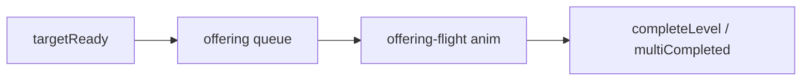

# Feature: `door-offering` — 门与献上

## 行为摘要

目标门 silhouette、合成目标后自动献门、多目标进度、门气泡对话。见 [`GAME_MECHANICS.md`](../../GAME_MECHANICS.md) 第三节。

## H5 文件

| 文件 | 职责 | 关键符号 |
|------|------|----------|
| [`js/game/game-door.js`](../../js/game/game-door.js) | 门状态、献上队列、tap | `doorStage`, `performOffering`, `onDoorTap` |
| [`js/game/game-core.js`](../../js/game/game-core.js) | `showDoorBubble` | L1920+ |
| [`js/game/game-synthesis.js`](../../js/game/game-synthesis.js) | 献门动画、多目标 | |
| [`game.html`](../../game.html) | `#door-area` DOM | |

## 小程序文件

| 文件 | 职责 | 关键符号 |
|------|------|----------|
| [`utils/game/door.js`](../../miniapp-weixin/utils/game/door.js) | 门 tap、献上 | `onDoorTap`, offering queue |
| [`utils/door-dialog.js`](../../miniapp-weixin/utils/door-dialog.js) | 气泡定位/文案 | `showDoorBubble` |
| [`pages/game/game-door.wxss`](../../miniapp-weixin/pages/game/game-door.wxss) | 门样式 | |
| [`pages/game/game-bubble.wxss`](../../miniapp-weixin/pages/game/game-bubble.wxss) | 气泡 | |

## 数据依赖

- `LEVELS[].target`, `multiTarget`, `multiTargets[]`
- `doorDialogs`, `completionText`

## 数据流

## 修改检查清单

- [ ] 门气泡 fixed + 尾巴动画
- [ ] 104 双目标、101 单目标手动测

## 已知差异 / 历史 bug

- 多目标 `multiTargetRows` 仅小程序 wxml 显式列表
