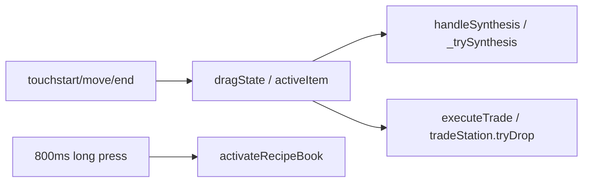

# Feature: `drag-drop` — 拖拽与长按

## 行为摘要

拖拽合成、物品栏 clone（无限供应）、长按配方书/提取、交易台 proximity。见 [`GAME_MECHANICS.md`](../../GAME_MECHANICS.md) 第一、二节。

## H5 文件

| 文件 | 职责 | 关键符号 |
|------|------|----------|
| [`js/game/game-drag.js`](../../js/game/game-drag.js) | 主实现 | `DragSystem` |
| [`js/drag-drop.js`](../../js/drag-drop.js) | 兼容 re-export | 指向 `game-drag.js` |
| [`game.html`](../../game.html) | 加载顺序 | `game-drag.js` before `game-core.js` |

## 小程序文件

| 文件 | 职责 | 关键符号 |
|------|------|----------|
| [`utils/game/drag.js`](../../miniapp-weixin/utils/game/drag.js) | touch 拖拽、长按、ghost | mixin 到 controller |
| [`utils/game/controller.js`](../../miniapp-weixin/utils/game/controller.js) | wiring | `onWorkshopTouch*`, `onInventoryTouch*` |
| [`pages/game/game.wxml`](../../miniapp-weixin/pages/game/game.wxml) | dragGhost | |

## 数据依赖

- `initialItems`, `infiniteItems`, `spawnInfiniteOnWorkbench`

## 样式

| H5 | 小程序 |
|----|--------|
| `css/game/game-items.css` | `game-items.wxss` |

## 数据流

## 修改检查清单

- [ ] 物品栏拖出后原槽 placeholder 恢复（无限供应）
- [ ] `compare-parity game 101` + `game 102`

## 已知差异 / 历史 bug

- 长按完成不应清掉 dragState（105 交易）
