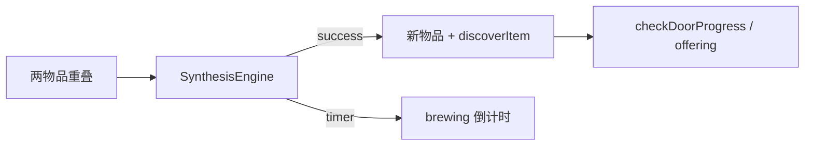

# Feature: `synthesis` — 合成引擎与流程

## 行为摘要

两物品配方 lookup、计时酿造、成功/失败动画、发现物品、触发献门。见 [`GAME_MECHANICS.md`](../../GAME_MECHANICS.md) 第一节。

## H5 文件

| 文件 | 职责 | 关键符号 |
|------|------|----------|
| [`js/synthesis.js`](../../js/synthesis.js) | 引擎 | `SynthesisEngine.synthesize` |
| [`js/game/game-synthesis.js`](../../js/game/game-synthesis.js) | 合成 UX、献门、过关 | `handleSynthesis`, `performOffering` |
| [`js/game/game-core.js`](../../js/game/game-core.js) | 酿造 UI 创建 | brewing 相关 |
| [`js/data/data-items.js`](../../js/data/data-items.js) | `RECIPES` | |

## 小程序文件

| 文件 | 职责 | 关键符号 |
|------|------|----------|
| [`utils/synthesis-engine.js`](../../miniapp-weixin/utils/synthesis-engine.js) | 引擎 | `synthesize()` |
| [`utils/game/synthesis-flow.js`](../../miniapp-weixin/utils/game/synthesis-flow.js) | `_trySynthesis` 及后续 | |
| [`utils/game/controller.js`](../../miniapp-weixin/utils/game/controller.js) | wiring | |

## 数据依赖

- `RECIPES[]`: `{ ingredients, result, time?, msg? }`
- `ITEMS[name].type`, `extracts`, `isRecipeBook`

## 样式

| H5 | 小程序 |
|----|--------|
| `css/game/game-synthesis.css` | `game-items.wxss` brewing |

## 数据流

## 修改检查清单

- [ ] 新配方写入 H5 `data-items.js` 后 `export-data.mjs`
- [ ] `compare-parity game 101`

## 已知差异 / 历史 bug

- 小程序暂无 `findRecipeForThree`（三物品配方）
