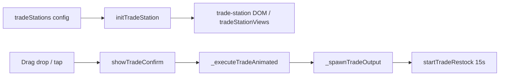

# Feature: `trade-station` — 交易台

## 行为摘要

物品交易台（拖入/点击确认）与钻石交易台（点击确认扣钻）；交易后 15 秒进货冷却；产出留在合成区。见 [`GAME_MECHANICS.md`](../../GAME_MECHANICS.md) 第二节。

## H5 文件

| 文件 | 职责 | 关键符号 |
|------|------|----------|
| [`js/game/game-trade.js`](../../js/game/game-trade.js) | 交易台 + recipe book 阶段入口 | `initTradeStation`, `_initRecipeBookTrade`, `showTradeConfirm` |
| [`js/game/game-drag.js`](../../js/game/game-drag.js) | 拖放到交易台 proximity / drop | `DragSystem` 内 trade 相关 |
| [`game.html`](../../game.html) | 脚本加载 | `game-trade.js` after `game-core.js` |

## 小程序文件

| 文件 | 职责 | 关键符号 |
|------|------|----------|
| [`utils/trade-station.js`](../../miniapp-weixin/utils/trade-station.js) | 交易台状态、布局、drop、确认 | `TradeStationManager` |
| [`utils/game/controller.js`](../../miniapp-weixin/utils/game/controller.js) | 委托 `_initTradeStations`, touch 转发 | `tradeStation.*` |
| [`pages/game/game.wxml`](../../miniapp-weixin/pages/game/game.wxml) | 交易台 UI、确认弹窗 | `tradeStationViews`, `tradeConfirm` |
| [`pages/game/game-trade-station.wxss`](../../miniapp-weixin/pages/game/game-trade-station.wxss) | 样式 | |

## 数据依赖

- `LEVELS[].tradeStations[]` / `tradeStation`：`{ input, output, type?, cost?, maxUses? }`
- 105 关：2 个 gem 台 + 物品台（见 `data-worlds.js`）

## 样式

| H5 | 小程序 |
|----|--------|
| `css/game/game-trade-station.css` | `game-trade-station.wxss` |

## 数据流

## 修改检查清单

- [ ] 对照 H5 `game-trade.js` 与 `trade-station.js`
- [ ] 测 105：拖拽 + 点击 gem 台
- [ ] `node compare-parity.cjs game 105`

## 已知差异 / 历史 bug

- 105 拖拽 hit 区域曾用圆心距离，已改 AABB + proximity
- 小程序曾把 `iconSrc` 放进 setData 导致 OOM（已改 PNG + WXS）
